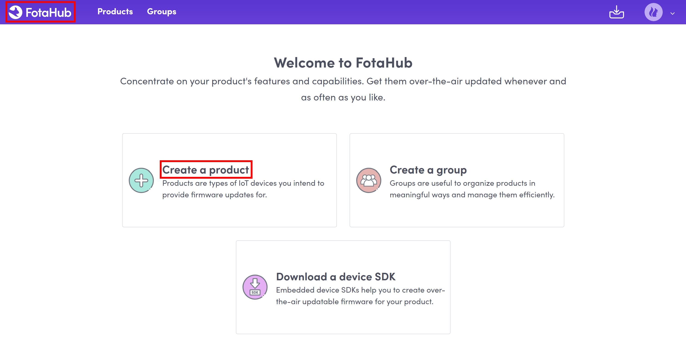
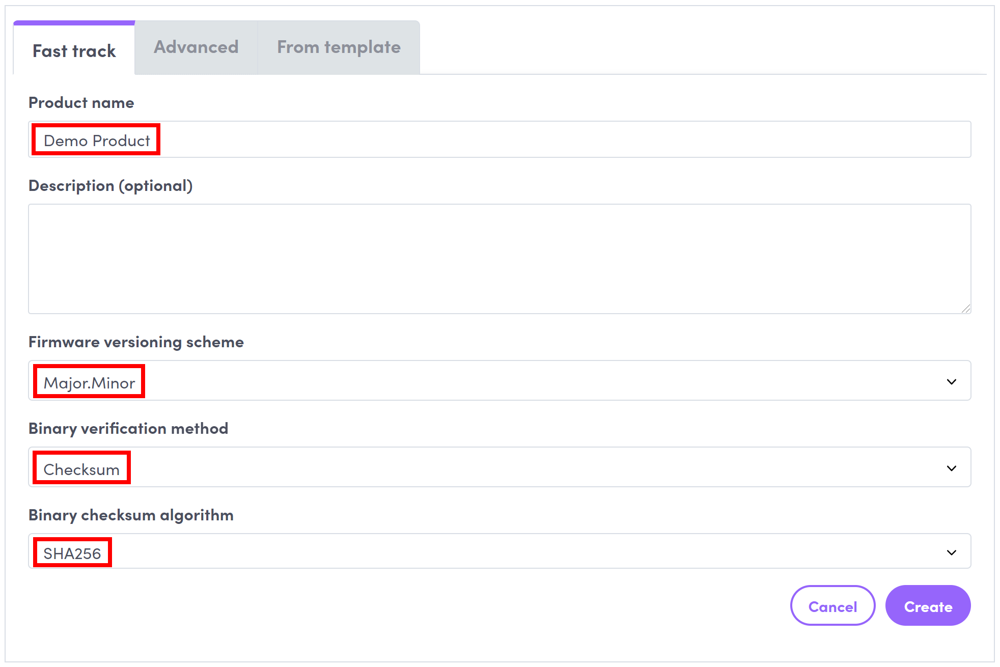

# How to create a simple FotaHub product for your device or board

1. Go to [FotaHub](https://fotahub.com), and sign in with your existing account or sign up for a one if you don't have any yet.

2. Click on the FotaHub logo in the title bar, and then on `Create a product`:

 

3. In the product creation wizard, go ahead using the `Fast track` mode. Enter the name of your product and select the versioning scheme you want to use for your firmware versions. Also choose the binary verification method and algorithm your device or board uses to verify new firmware versions downloaded from FotaHub before applying them. Optionally, you can also add a description for your product. To begin with, simply choose the values matching the default configuration of the FotaHub Device SDK examples as per below:

4. Click on `Create` to finalize the creation of your FotaHub product.