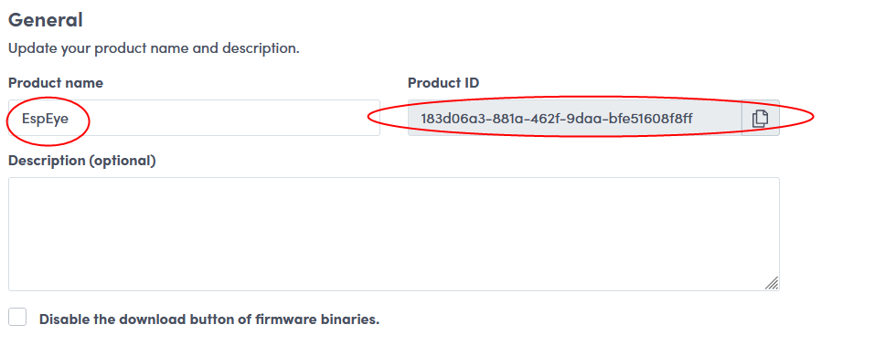
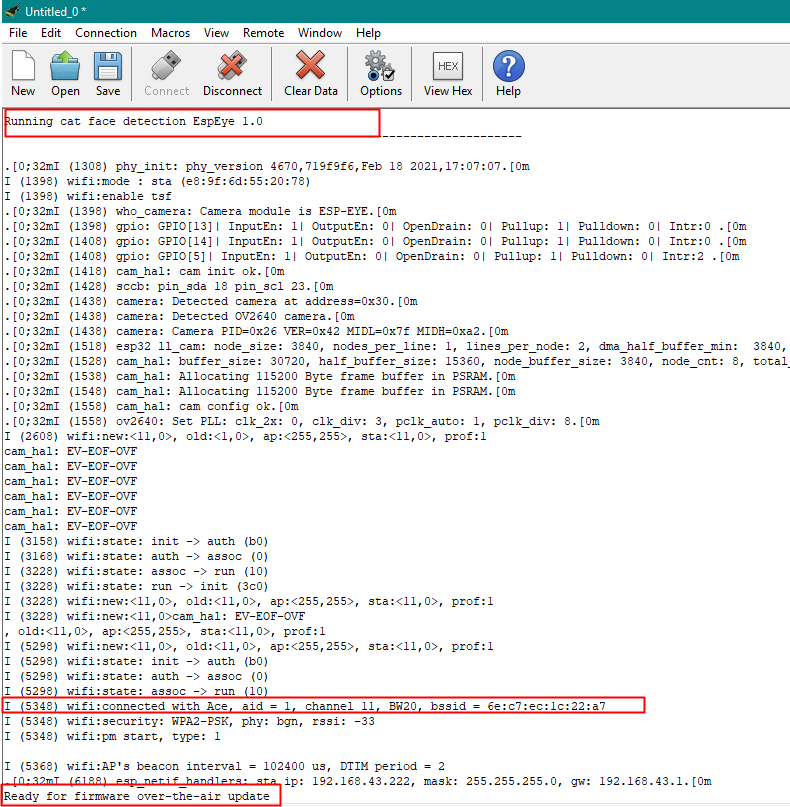
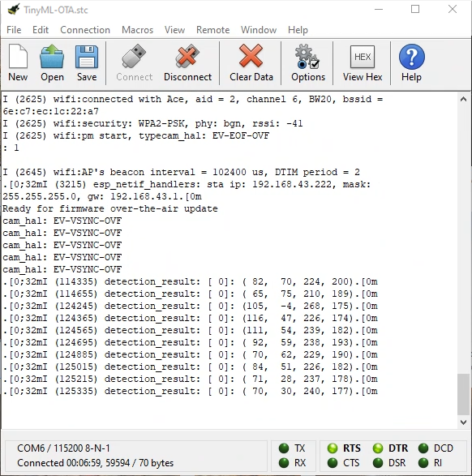
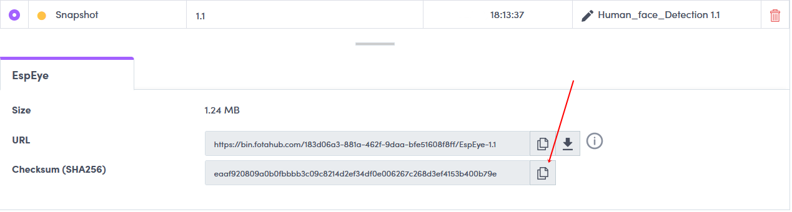
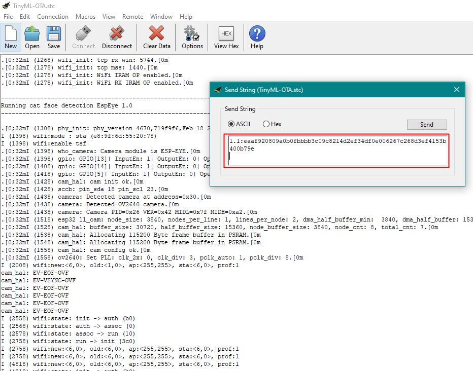
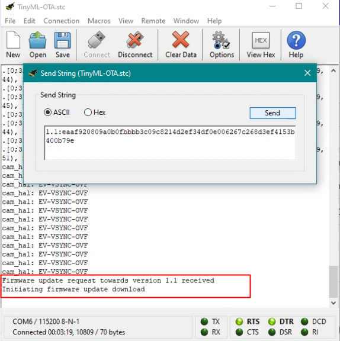
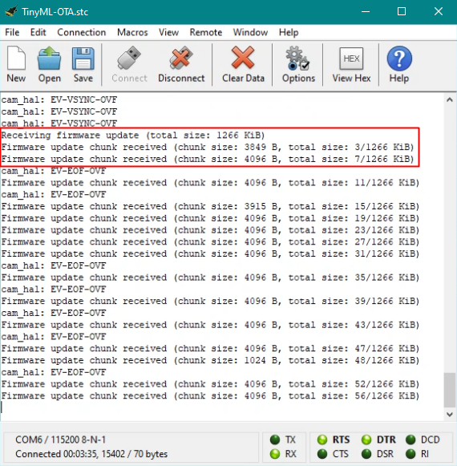
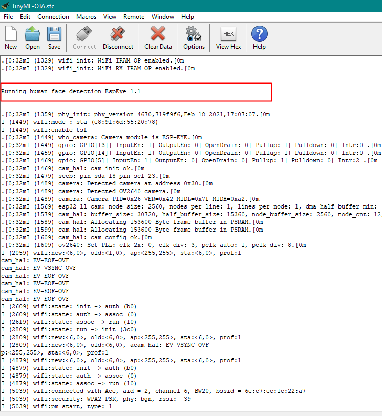
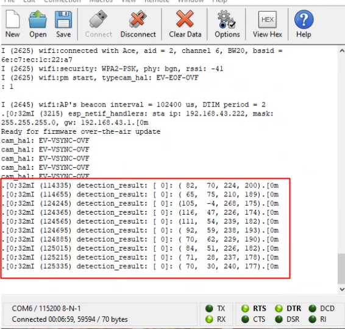

# TinyML FOTA update example

Tiny Machine Learning (TinyML) is a field of Machine Learning that focuses on the development and deployment of Machine Learning models on low power devices (embedded Linux or microcontroller-based). It's a combination between embedded systems and machine learning algorithms. FotaHub enables TinyML models running on such devices to be updated Over-The-Air (OTA). It thus solves the challenging problem of continuously deploying and improving the capabilies of AI-powered devices during their whole lifetime and regardless of their physical location. This example demonstrates how easy it is to put OTA updates of TinyML models through FotaHub into practice using Espressif's [ESP-EYE](https://www.espressif.com/en/products/devkits/esp-eye/overview) board. 

## Overview

Deep neural networks have gained fame for their capability to process visual information. In the past few years, they have become a key component of many computer vision applications. With that being said, the TinyML models used in this example fall under the computer vision shadow as well. The goal is to make an initial deployment of a cat face detection model on the ESP-EYE, and then over-the-air update it to a human face detection model.

## Operating principle :
The device listens for a TinyML model update info string to be sent over the serial port. It is expected to consist of the new model version the device should be updated to, followed by a ':' separator and the checksum or signature of the new model version: 

```
<new-version>:<verification-data>
```

For example:<br>

```
 1.1:a15d5599d8745ff4f51690eb3996afcf75d0b1729d1b8cda2491b03940417521
```
Once a valid update info string has been received and the contained new model version is different from the version of the model already running on the device, the model update procedure is triggered. It involves the device to connect to FotaHub and download the binary of the new model version. Thereby, it uses a dedicated URL including the id of the product representing the device in FotaHub, and the name and the version of the TinyML model binary to be retrieved, e.g.: <br> 
```
https://bin.fotahub.com/7f52cf5e-7f0d-49dc-87fd-679ebfb94d8d/DemoProduct-1.1 
```
The downloaded TinyML model binary is stored in the device's flash memory. At the same time, the downloaded model binary's checksum or signature is recalculated and compared to the checksum or signature included in the previously communicated update info string. If both match, the model update is applied by restarting the device and letting it boot into the flash memory partition where the downloaded TinyML model binary has been stored. After the restart, the device executes the new model version downloaded from FotaHub.

## Supported targets :
Both cat face detection and human face detection can be used as is with ESP EYE board.

## Installation :

A description of the SDKs and tools that must be available on your laptop or computer, advise how to install them can be found [here](https://github.com/fotahub/fotahub-device-sdk-esp32/blob/main/README.md#installation).

# Usage :
## Get the FotaHub Device SDK for ESP : 
		
Download and uncompress the [FotaHub Device SDK](https://github.com/fotahub/fotahub-device-sdk-esp32) for ESP to a location in your machine.
		
Note: Make sure that the path to the location of the FotaHub Device SDK for ESP on your machine does not contain any spaces.
			
## Create a FotaHub product : 

Create a FotaHub product that represents your board in FotaHub as explained [here](https://github.com/fotahub/fotahub-device-sdk-esp32/blob/main/docs/fotahub/create-product.md), because product information such as its name and id will be used to upload and provide the TinyML model update as previously explained.

#   Create and run initial Cat face detection TinyML model : 

1. Start the Visual Studio Code and open `(File > Folder...)` 
Cat face detection example included in the FotaHub Device SDK for ESP32 
(`<device-sdk-root>/examples/huzzah32/TinyML/Cat_face_detection`) .
		
2. Inside main folder, go to the `Configuration.h` , and initialize the `WIFI_STATION_SSID` and `WIFI_STATION_PASSPHRASE` constants with the credentials of the Wi-Fi network you want to connect to with your board:
```C
#define WIFI_STATION_SSID "my-fancy-WiFi-SSID"

#define WIFI_STATION_PASSPHRASE "my-cryptic-WiFi-passphrase"
```
3. Open the DemoProductInfo.h file in the main folder, and initialize the `DEMO_PRODUCT_ID` and `DEMO_PRODUCT_NAME` constants with the id and the name of the previously created FotaHub product (`see Products > {{Your FotaHub product}} > Settings > General at Fotahub`). 



Leave the `DEMO-PRODUCT-FIRMWARE-VERSION` as is for now.<br>
<p style="margin-left: 2em">Leave the <code>DEMO_PRODUCT_FIRMWARE_VERSION</code> as is for now. In case you have selected anything else than <code>SHA256</code> as the binary checksum algorithm for your FotaHub product or opted for using a signature instead, you also must adjust the <code>DEMO_PRODUCT_FIRMWARE_UPDATE_VERIFICATION_ALGORITHM</code> constant accordingly:</p>

```C
#define DEMO_PRODUCT_FIRMWARE_VERSION "1.0"

#define DEMO_PRODUCT_FIRMWARE_UPDATE_VERIFICATION_ALGORITHM FOTA_UPDATE_VERIFICATION_ALGORITHM_SHA256
```
4- To build the initial Cat face detection example, you should be able to find a `bind.bat` file inside the cat face detection folder, right-click on it and chose "open in integrated terminal" ,then invoke the bind command.
`bind` stands for (Build IN Docker) ,When you have opted to use the ESP-IDF SDK and ESP32 toolchain through Docker, the build must run inside a Docker container providing the same. You can achieve that conveniently by making sure that Docker is running on your machine and then invoke the `bind.bat` or `bind.sh` script according to your operating system:
### <b> Windows </b> :

```
bind
```
### <b> Linux/Mac OS X </b>:
```
./bind.sh
```
If you have installed the ESP-IDF SDK and ESP32 toolchains directly on your machine, you can invoke the `idf.bat`/`idf.sh` script right away. Specify the ESP-IDF install or checkout location as first and the build command as second argument:

### <b> Windows </b> :

```
idf <ESP-IDF install/checkout location> build
```
### <b> Linux/Mac OS X </b>:
```
./idf.sh <ESP-IDF install/checkout location> build
```
> 🛈 When you need to run this command frequently, you may want to make known the ESP-IDF install or checkout location once for all by setting an environment variable named IDF_PATH at user or system level. You then only need to specify the build command as argument when invoking the idf.bat/idf.sh script.

5. Connect your board to your machine using a USB cable, and identify the corresponding serial port (a guide explaining how to do so can be found [here](https://docs.espressif.com/projects/esp-idf/en/latest/esp32/get-started/establish-serial-connection.html) ) .

> ⚠ It may happen that you are unable to find the serial port your board is connected to. Most of the time this is because the device driver for the USB to serial converter chip of your board is missing. You can fix that by manually installing the same as explained [here](https://github.com/fotahub/fotahub-device-sdk-esp32/blob/main/README.md#general-purpose-tools).

6. Flash TinyML model binary that has resulted from building the Cat face detection example to your board.

> If you have used Docker and bind to build the firmware binary, you will notice that two new scripts, namely `flash.bat`/`flash.sh` and `erase.bat`/`erase.sh` have been created along the way. Use the first one to flash the firmware binary to your board and provide the serial port it is connected to as argument:
### <b> Windows </b> :

```
flash <COM port name, e.g., COM3>
```
### <b> Linux/Mac OS X </b>:
```
./flash.sh <serial port name, e.g., /dev/ttyUSB0>
```
If you have built the firmware binary with the help of the idf.bat/idf.sh script and the ESP-IDF SDK and ESP32 toolchains installed on your machine, use the same idf.bat/idf.sh script also to flash the firmware binary to your board. Specify the flash command as first and the serial port your board is connected to as second argument:

### <b> Windows </b> :

```
idf flash <COM port name, e.g., COM3>
```
### <b> Linux/Mac OS X </b>:
```
./idf.sh flash <serial port name, e.g., /dev/ttyUSB0>
```
7. Start your serial monitor app, point it at the serial port your board is connected to, and set the baudrate to 115200 (Connection > Options... in CoolTerm). Open the configured serial port (Connection > Connect in CoolTerm), observe how the TinyML example starts up and verify whether it connects to the Wi-Fi network:



Great ! now we're set ,ready to go for a quick test, open your browser and google cat faces, point your Esp Eye to one of the faces and observe them being detected in the serial monitor in the form of coordinates.




# Create and upload a new model version to FotaHub : 
1- the aim of this demonstration is to move from the cat face detection to human face detection like previously mentioned.<br> to make this update possible, open ( `File > Folder...`) Human face detection example included in the FotaHub Device SDK for ESP32 (`<device-sdk-root>/examples/huzzah32/TinyML/Human_face_detection`) and
go to the `DemoPrudctInfo.h` inside the main folder, 

initialize the `DEMO_PRODUCT_ID` and `DEMO_PRODUCT_NAME` constants with the id and the name of the previously created FotaHub product like we did in the previous section( step 3 ) and this time bump the `DEMO-PRODUCT-FIRMWARE-VERSION` constant to `1.1` :
```C
#define DEMO_PRODUCT_ID "183d06a3-881a-462f-9daa-bfe51608f8ff"

#define DEMO_PRODUCT_NAME "EspEye"

#define DEMO_PRODUCT_FIRMWARE_VERSION "1.1"

#define DEMO_PRODUCT_FIRMWARE_UPDATE_VERIFICATION_ALGORITHM FOTA_UPDATE_VERIFICATION_ALGORITHM_SHA256
```
2. Sure enough we need to initialize the `WIFI_STATION_SSID` and `WIFI_STATION_PASSPHRASE` constants with the credentials of the Wi-Fi network for this example as well ( see step 2 in previous section )	.
		
3. Now we build the example using bind just like we have for building the initial Cat face detection model (see step 4 in previous section),
Locate the resulting new model binary file named humanfacedetection.bin in the build folder (using the Explorer view) .
		
4. Upload the new binary (build/humanfacedetection.bin) as the new model version 1.1 to your FotaHub product as explained [here](https://github.com/fotahub/fotahub-device-sdk-esp32/blob/main/docs/fotahub/upload-firmware.md).
<br>
<br>

#  Make your TinyML OTA update : 
1. Once the binary file is uploaded into FotaHub platform, go to (` Products > {{Your FotaHub product}} > Details`), and retrieve the cheksum or the signature from there .
<br>
<br>

Now go back to the serial monitor app showing the execution status of your board running the initial model version, click on (`Connection > Send String... in CoolTerm`) ,
Enter the new model version (1.1 for instance) followed by a ':' separator, followed by the checksum or signature of product you previously retrieved from FotaHub platform, terminate with a `line break` in the text field or dialog provided for sending data over the opened serial port :



2. Submit the model update info string to your board (Send button in CoolTerm). This will trigger the OTA update procedure. Upon successful completion, the board will be restarted with the new model version downloaded from FotaHub. To verify that, check the model version in the banner showing up in the serial monitor output:	





Once the update is terminated successfully ,point your Esp Eye to your face and observe your face's coordinates getting print on the screen.


