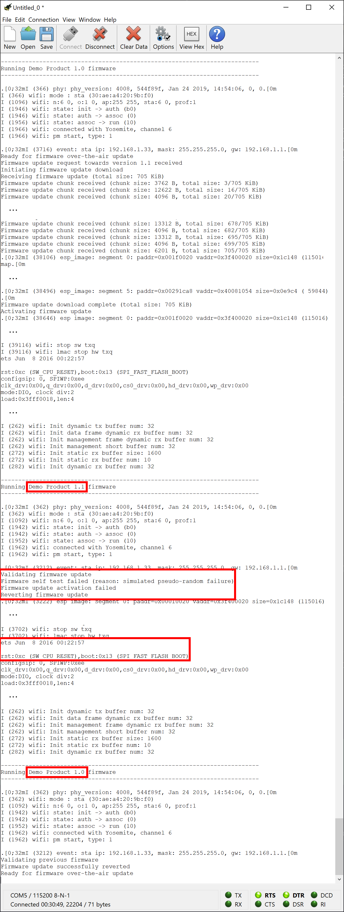

# Revertible FOTA update example

The *Revertible* example is an enhanced version of the [Simple](simple.md) example. It demonstrates how a firmware update can automatically revert itself to the previous version in case that something is wrong with the new one.

## Operating principle

The firmware over-the-air update procedure gets triggered and works in the same way as in the [Simple](simple.md) example up to the point where the new firmware version gets activated. Right after starting the new firmware version, a built-in self test procedure is launched. Only when the latter completes successfully, the new firmware version is confirmed and becomes definite. In the opposite case, the previous firmware version is restored.

For obvious reasons, the ultimately required self test logic depends heavily on the nature of the underlying IoT application and device. The revertible example therefore implements only a very simple self test stub which returns a positive or negative result on a pseudo-random basis (see [DemoFOTAUpdateSelfTest.c](../../examples/huzzah32/revertible/demoproduct/DemoFOTAUpdateSelfTest.c) for details). Consequently, the firmware update carried out in this example may succeed and remain in place or fail and be reverted to the previous version depending on how it goes. To see both scenarios happening, just run the same example multiple times. You can also force either of them by setting the `SIMULATED_ACTIVATION_SUCCESS_RATE` constant in [DemoFOTAUpdateSelfTest.h](../../examples/huzzah32/revertible/demoproduct/DemoFOTAUpdateSelfTest.h) to `100` or `0`.

## Usage

1. Follow the usage instructions of the Simple example as described [here](simple.md#usage).

2. In the very last step, you will observe the same result and a very similar serial monitor output as with the *Simple* example in case the built-in self test succeeds. Otherwise, you will see that the new fimware version initiates the reversion of the firmware update, the board is restarted another time, and the previous firmware version is resumed:

 