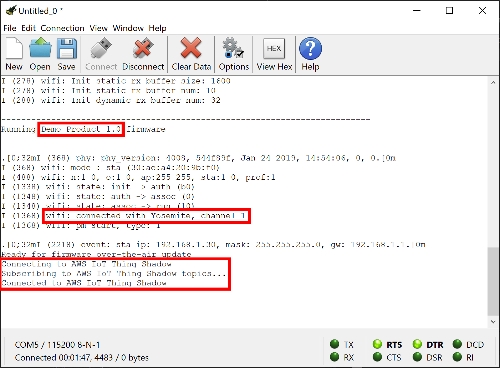
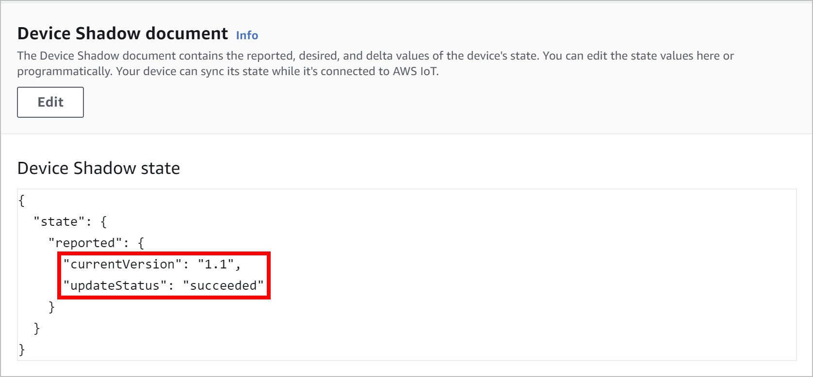

# AWS IoT Thing Shadow-driven FOTA update example

The *Thing Shadow* example demonstrates a real-world firmware over-the-air update procedure using the AWS IoT Thing Shadow (aka Device Shadow) service. The thing shadow is used to trigger firmware over-the-air updates on the device it represents through the cloud. Thanks to that, the device itself can be located in any place where Wi-Fi and Internet are available and does no longer need to be connected to a USB port of your laptop or computer as with the [Simple](simple.md) and [Rollbackable](rollbackable.md) examples. The thing shadow example also detects misbehaving firmware updates and rolls them back to the previous version.

## Technical context

If you are new to AWS IoT in general or the AWS IoT Thing Shadow service, you can find relevant introductory as well as detailed technical information [here](https://docs.aws.amazon.com/iot/latest/developerguide/what-is-aws-iot.html) and [here](https://docs.aws.amazon.com/iot/latest/developerguide/iot-device-shadows.html).

For the sake of simplicity, an unnamed *classic shadow* is used in this example. The standard [MQTT protocol](https://mqtt.org) and the [thing shadow MQTT topics](https://docs.aws.amazon.com/iot/latest/developerguide/reserved-topics.html#reserved-topics-shadow) defined by AWS are used for the communication between the device and its thing shadow.

## Operating principle

After startup, the device connects first to the configured Wi-Fi network and then to its AWS IoT Thing Shadow. It reports the currently running firmware version resulting in a shadow state document as follows:

```json
{
    "state": {
        "reported": {
            "currentVersion": "1.0",
            "updateStatus": "none"
        }
    }
}
```

From there on, the device listens for MQTT messages being published at the `ShadowTopicPrefix/update/delta` topic. It retrieves the delta state document from the body of such messages, and checks whether it includes a new firmware version the device should be updated to as well as the verification data, i.e., the checksum or signature of the new firmware version like in the following example:

```json
{
    "state": {
        "newVersion": "1.1",
        "verificationData": "a15d5599d8745ff4f51690eb3996afcf75d0b1729d1b8cda2491b03940417521"
        }
    },
    ...
}
```

When this is the case, a firmware update procedure is triggered. It involves the device to disconnect from its AWS IoT Thing Shadow, connect to FotaHub and download the binary of the new firmware version. Thereby, it uses a dedicated URL including the id of the product representing the device in FotaHub, and the name and the version of the firmware binary to be retrieved, e.g.:

`https://bin.fotahub.com/7f52cf5e-7f0d-49dc-87fd-679ebfb94d8d/DemoProduct-1.1`

The downloaded firmware binary is stored in the device's flash memory. At the same time, the downloaded firmware binary's checksum or signature is recalculated and compared to the checksum or signature included in the previously received delta state document. If both match, the firmware update is applied by restarting the device and letting it boot into the flash memory partition where the downloaded firmware binary has been stored. 

After the restart, the device starts executing the new firmware version downloaded from FotaHub. To be sure that it behaves as expeced, a built-in self test procedure is launched. Only when the latter completes successfully, the new firmware version is confirmed and becomes definite. In the opposite case, the previous firmware version is restored.

For obvious reasons, the ultimately required self test logic depends heavily on the nature of the underlying IoT application and device. The thing shadow example therefore implements only a very simple self test stub which returns a positive or negative result on a pseudo-random basis (see [DemoFOTAUpdateSelfTest.c](../../examples/huzzah32/thingshadow/main/DemoFOTAUpdateSelfTest.c) for details). Consequently, the firmware update carried out in this example may succeed and remain in place or fail and be rolled back to the previous version depending on how it goes. To see both scenarios happening, just run the same example multiple times. You can also force either of them by setting the `SIMULATED_ACTIVATION_SUCCESS_RATE` constant in [DemoFOTAUpdateSelfTest.h](../../examples/huzzah32/thingshadow/main/DemoFOTAUpdateSelfTest.h) to `100` or `0`.

## Supported targets

The Simple example can be used as is with the [Adafruit Feather HUZZAH32](https://learn.adafruit.com/adafruit-huzzah32-esp32-feather) board. With some adaptations, it can also be used with any other ESP32 development board or hardware product.  

## Installation

A description of the SDKs and tools that must be available on your laptop or computer and advise how to install them can be found [here](../../README.md#installation).

## Usage

### Create an AWS IoT thing

1. If you have never used AWS so far, you must create a new AWS account first. You can follow the steps described [here](https://docs.aws.amazon.com/iot/latest/developerguide/setting-up.html) to do so.

2. Log in to the [AWS IoT Console](https://console.aws.amazon.com/iot/home) and set up an AWS IoT thing for your board: 
   * Create an AWS IoT policy which authorizes your board to exchange messages with AWS IoT 
   * Create the AWS IoT thing itself along with an X.509 board certificate that is used to authenticate your board to AWS IoT

A comprehensive guide explaining how to proceed in detail can be found [here](https://docs.aws.amazon.com/iot/latest/developerguide/create-iot-resources.html). 

1. Delete the initially created unnamed classic shadow of your AWS IoT thing (`Manage` > `Things` > `{{Your AWS IoT thing}}` > `Device Shadows` > `Classic Shadow` > `Delete` when using the *New console experience* which can be activated all down in the left side bar).

### Create a FotaHub product

Create a FotaHub product that represents your board in FotaHub as explained [here](../fotahub/create-product.md). It will be used to upload and provide firmware updates for the same. 

### Get the FotaHub Device SDK for ESP32

If not yet done so, either clone or download and uncompress the [FotaHub Device SDK for ESP32](https://github.com/fotahub/fotahub-device-sdk-esp32) to a location of your choice on your machine. 

> &#x26A0; Make sure that the path to the location of the FotaHub Device SDK for ESP32 on your machine does not contain any spaces.

### Prepare initial firmware version

1. Start Visual Studio Code and open (`File` > `Folder...`) the `Thing Shadow` example included in the FotaHub Device SDK for ESP32 (`<device-sdk-root>/examples/huzzah32/thingshadow`).

2. Go to the `Configuration.h` file in the `main` folder, and initialize the `WIFI_STATION_SSID` and `WIFI_STATION_PASSPHRASE` constants with the credentials of the Wi-Fi network you want to connect to with your board:
   
    ```c
    #define WIFI_STATION_SSID "my-fancy-WiFi-SSID"

    #define WIFI_STATION_PASSPHRASE "my-cryptic-WiFi-passphrase"
    ```

3. Open the `DemoProductInfo.h` file in the `main` folder, and initialize the `DEMO_PRODUCT_ID` and `DEMO_PRODUCT_NAME` constants with the id and the name of the previously created FotaHub product (see `Products` > `{{Your FotaHub product}}` > `Settings` > `General` at [Fotahub](https://fotahub.com)). Leave the `DEMO_PRODUCT_FIRMWARE_VERSION` as is for now. In case you have selected anything else than `SHA256` as the binary checksum algorithm for your FotaHub product or opted for using a signature instead, you also must adjust the `DEMO_PRODUCT_FIRMWARE_UPDATE_VERIFICATION_ALGORITHM` constant accordingly:

    ```c
    #define DEMO_PRODUCT_ID "7f52cf5e-7f0d-49dc-87fd-679ebfb94d8d"

    #define DEMO_PRODUCT_NAME "Demo Product"

    #define DEMO_PRODUCT_FIRMWARE_VERSION "1.0"

    #define DEMO_PRODUCT_FIRMWARE_UPDATE_VERIFICATION_ALGORITHM FOTA_UPDATE_VERIFICATION_ALGORITHM_SHA256
    ```

4. Open the `AWSIoTThingShadowConfiguration.c` file in the `main` folder, and initialize the `hostNameEndPoint.hostName` and `awsIoTConnParams.thingName` struct variable fields with your AWS account's [device data endpoint](https://docs.aws.amazon.com/iot/latest/developerguide/iot-connect-devices.html#iot-connect-device-endpoints) and the name of the previously created AWS IoT thing (see `Settings` > `Device data endpoint` and `Manage` > `Things` in the [AWS IoT Console](https://console.aws.amazon.com/iot/home) when using the *New console experience* which can be activated all down in the left side bar):

    ```c
    HostNameEndpointAddress_t hostNameEndPoint = 
    {
    ...
    .hostName = "c1bskcyiphilz6-ats.iot.eu-central-1.amazonaws.com"
    };

    ...

    AWSIoTConnectionParameters_t awsIoTConnParams = 
    {
    .thingName = "FotaHubExampleThing", 
    ...
    };
    ```

5. Open the `Certificate.pem` and `PrivateKey.pem` files included in the thing shadow example. Replace all their content with that from the certificate and private key files which you have created and downloaded during the setup of the AWS IoT thing for your board. Those are typically named something like `3d19eba035-certificate.pem.crt` and `3d19eba035-private.pem.key`. 
   
### Build and flash initial firmware version

1. Open the integrated terminal (`Terminal` > `New Terminal`) and build the example with the help of the `idf.bat` or `idf.sh` script.
    
    When you have opted to use the ESP-IDF SDK and ESP32 toolchains through Docker, the `idf.bat`/`idf.sh` script must be run inside a Docker container providing the same. You can achieve that conveniently by making sure that Docker is running on your machine and invoking the `bind.bat`/`bind.sh` (**B**uild **IN** **D**ocker) script according to your operating system:
   
    **Windows:**   
    ```bat
    bind
    ```
    **Linux/Mac OS X:**   
    ```sh
    ./bind.sh
    ```

    If you have installed the ESP-IDF SDK and ESP32 toolchains directly on your machine, you can invoke the `idf.bat`/`idf.sh` script right away. Specify the ESP-IDF install or checkout location as first and the `build` command as second argument:

    **Windows:**   
    ```bat
    idf <ESP-IDF install/checkout location> build
    ```
    **Linux/Mac OS X:**   
    ```sh
    ./idf.sh <ESP-IDF install/checkout location> build
    ```

    > &#x1F6C8; When you need to run this command frequently, you may want to make known the ESP-IDF install or checkout location once for all by setting an environment variable named `IDF_PATH` at user or system level. You then only need to specify the `build` command as argument when invoking the `idf.bat`/`idf.sh` script.

2. Connect your board to your laptop or computer using a USB cable, and identify the corresponding serial port (a guide explaining how to do so can be found [here](https://docs.espressif.com/projects/esp-idf/en/latest/esp32/get-started/establish-serial-connection.html)).

    > &#x26A0; It may happen that you are unable to find the serial port your board is connected to. Most of the time this is because the device driver for the USB to serial converter chip of your board is missing. You can fix that by manually installing the same as explained [here](../../README.md#general-purpose-tools).

3. Flash the firmware binary that has resulted from building the example to your board.
   
    If you have used Docker and `bind` to build the firmware binary, you will notice that two new scripts, namely `flash.bat`/`flash.sh` and `erase.bat`/`erase.sh` have been created along the way. Use the first one to flash the firmware binary to your board and provide the serial port it is connected to as argument:

    **Windows:**   
    ```bat
    flash <COM port name, e.g., COM3>
    ```
    **Linux/Mac OS X:**   
    ```sh
    ./flash.sh <serial port name, e.g., /dev/ttyUSB0>
    ```

    If you have built the firmware binary with the help of the `idf.bat`/`idf.sh` script and the ESP-IDF SDK and ESP32 toolchains installed on your machine, use the same `idf.bat`/`idf.sh` script also to flash the firmware binary to your board. Specify the `flash` command as first and the serial port your board is connected to as second argument:

    **Windows:**   
    ```bat
    idf flash <COM port name, e.g., COM3>
    ```
    **Linux/Mac OS X:**   
    ```sh
    ./idf.sh flash <serial port name, e.g., /dev/ttyUSB0>
    ```

4. Start your serial monitor app, point it at the serial port your board is connected to, and set the baudrate to `115200` (`Connection` > `Options...` in CoolTerm). Open the configured serial port (`Connection` > `Connect` in CoolTerm), observe how the firmware starts up and verify whether it connects to the Wi-Fi network as well as to its AWS IoT Thing Shadow:

    

    Also have a look at the red LED (`GPIO #13`) next to the USB port on your board. It should blink with a period of approx. 1 s. 

5. Go back to the [AWS IoT Console](https://console.aws.amazon.com/iot/home) and visit the unnamed classic shadow of your AWS IoT thing (`Manage` > `Things` > `{{Your AWS IoT thing}}` > `Device Shadows` > `Classic Shadow` when using the *New console experience* which can be activated all down in the left side bar). Click on the refresh button if no such is displayed. You should see that yields a shadow state document with a `currentVersion` attribute that indicates the currently running firmware version on your board:

    

6. Stop your serial monitor app and disconnect your board from your laptop or computer. Use a USB wall charger to power it instead. Feel free to move your board to a different place if you like.  

### Create and upload a new firmware version to FotaHub

1. Go back to the `DemoProductInfo.h` file in the `main` folder, and bump the `DEMO_PRODUCT_FIRMWARE_VERSION` constant:

    ```c
    #define DEMO_PRODUCT_FIRMWARE_VERSION "1.1"
    ```

2. Make another change in your firmware, e.g., increase the blink frequency of the red LED on your board by going back to the `Configuration.h` file in the `main` folder and decreasing the `BLINK_PERIOD` constant:

    ```c
    #define BLINK_PERIOD 250
    ```

3. Rebuild the example using Docker and `bind` or the `idf.bat`/`idf.sh` script in very much the same way as you did for building the initial firmware version (see step 1 in the previous section). Locate the resulting new firmware binary file named `demoproduct.bin` in the `build` folder (using the `Explorer` view).
   
    > &#x1F6C8; You can locate the new firmware binary file also in your file system explorer or copy its path to the clipboard by using corresponding context menu actions in Visual Studio Code (`Reveal in File Explorer` and `Copy Path`). This can come quite handy in the subsequent steps.

4. Upload the new binary (`build/demoproduct.bin`) as firmware version `1.1` to your FotaHub product as explained [here](../fotahub/upload-firmware.md).

### Perform a cloud-triggered firmare over-the-air update 

You can perfom cloud-triggered firmare over-the-air updates either [interactively](#interactive-firmare-over-the-air-update-using-the-aws-iot-console) through the AWS IoT Console or [programmatically](#programmatic-firmare-over-the-air-update-using-the-aws-cli) by using the AWS CLI.

#### Interactive firmare over-the-air update using the AWS IoT Console

1. Go back to the [AWS IoT Console](https://console.aws.amazon.com/iot/home) and revisit the unnamed classic shadow of your AWS IoT thing (`Manage` > `Things` > `{{Your AWS IoT thing}}` > `Device Shadows` > `Classic Shadow` when using the *New console experience* which can be activated all down in the left side bar). Open the shadow state document for editing (`Device Shadow document` > `Edit`). Add a `desired` object with a `newVersion` attribute to indicate the new firmware version your board should be updated to and a `verificationData` attribute with the checksum or signature of the same (see `Products` > `{{Your FotaHub product}}` > `Details` > `{{New firmware version}}` at [Fotahub](https://fotahub.com)):

    ```json
    {
        "state": {
            "reported": {
                "currentVersion": "1.0",
                "updateStatus": "none"
            },
            "desired": {
                "newVersion": "1.1",
                "verificationData": "<checksum or signature>"
            }
        }
    }
    ```

2. Save the modified shadow state document (`Edit Device Shadow state` > `Update`). This will trigger the firmware over-the-air update procedure. Upon successful completion (typically after 1 minute or so), the board will be restarted with the new firmware version downloaded from FotaHub. The built-in self test is executed and, in case it succeeds, the new firmware version is confirmed and stays in place. You can see that
    * by observing the **red LED** on your board - it should end up blinking significantly faster than before
    * by inspecting the **shadow state document** in the AWS IoT Console - it should reflect the new firmware version as the currently running version and include an `updateStatus` attribute indicating the successful completion of the firmware over-the-air update:

    

    In case the built-in self test fails, the new fimware version initiates the reversion of the firmware update, the board is restarted another time, and the previous firmware version is resumed. You can see that
    * by observing the **red LED** on your board - it should continue to blink with the same frequency as before
    * by inspecting the **shadow state document** in the AWS IoT Console - it should reflect the initial firmware version as the currently running version and include an `updateStatus` attribute indicating the failure of the firmware over-the-air update:

    

#### Programmatic firmare over-the-air update using the AWS CLI

1. If not already done so, [install](https://docs.aws.amazon.com/cli/latest/userguide/install-cliv2.html) and [configure](https://docs.aws.amazon.com/cli/latest/userguide/cli-configure-quickstart.html#cli-configure-quickstart-config) the AWS CLI version 2.

2. Go back to the integrated terminal or just open a new one (`Terminal` > `New Terminal`) and trigger a firmware over-the-air update for your board by entering an [aws iot-data publish](https://awscli.amazonaws.com/v2/documentation/api/latest/reference/iot-data/publish.html) command as shown below. Provide the name of your AWS IoT thing, the new firmware version your board should be updated to as well as the checksum or signature of the same (see `Products` > `{{Your FotaHub product}}` > `Details` > `{{New firmware version}}` at [Fotahub](https://fotahub.com)):

    **Windows:**   
    ```bat
    aws iot-data publish --topic $aws/things/<Your AWS IoT thing>/shadow/update --cli-binary-format raw-in-base64-out --payload "{\"state\":{\"desired\":{\"newVersion\":\"1.1\",\"verificationData\":\"<checksum or signature>\"}}}"
    ```
    **Linux/Mac OS X:**   
    ```sh
    aws iot-data publish --topic \$aws/things/<Your AWS IoT thing>/shadow/update --cli-binary-format raw-in-base64-out --payload '{"state":{"desired":{"newVersion":"1.1","verificationData":"<checksum or signature>"}}}'
    ```
  
3. Upon successful completion (typically after 1 minute or so), the board will be restarted with the new firmware version downloaded from FotaHub. The built-in self test is executed and, in case it succeeds, the new firmware version is confirmed and stays in place. You can see that
   * by observing the **red LED** on your board - it should end up blinking significantly faster than before
   * by retrieving the **shadow state document** using the [aws iot-data get-thing-shadow](https://awscli.amazonaws.com/v2/documentation/api/latest/reference/iot-data/get-thing-shadow.html) command as follows - it should reflect the new firmware version as the currently running version and include an `updateStatus` attribute indicating the successful completion of the firmware over-the-air update:

    **Windows:**   
    ```bat
    aws iot-data get-thing-shadow --thing-name <Your AWS IoT thing> shadow-state.json && type shadow-state.json 
    ```
    **Linux/Mac OS X:**   
    ```sh
    aws iot-data get-thing-shadow --thing-name <Your AWS IoT thing> shadow-state.json && cat shadow-state.json
    ```

    **Resulting output:**

    ```bat
    {"state":{"reported":{"currentVersion":"1.1","updateStatus":"succeeded"}},"metadata":{...},"version":...,"timestamp":...}
    ```

    In case the built-in self test fails, the new fimware version initiates the reversion of the firmware update, the board is restarted another time, and the previous firmware version is resumed. You can see that
        * by observing the **red LED** on your board - it should continue to blink with the same frequency as before
        * by inspecting the **shadow state document** retrieved as per above - it should reflect the initial firmware version as the currently running version and include an `updateStatus` attribute indicating the failure of the firmware over-the-air update:*

    ```bat
    {"state":{"reported":{"currentVersion":"1.0","updateStatus":"failed"}},"metadata":{...},"version":...,"timestamp":...}
    ```