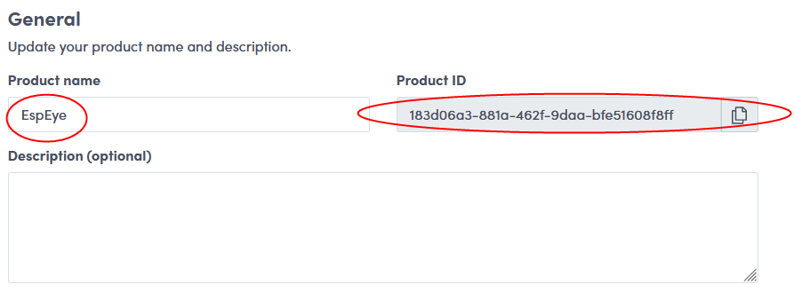
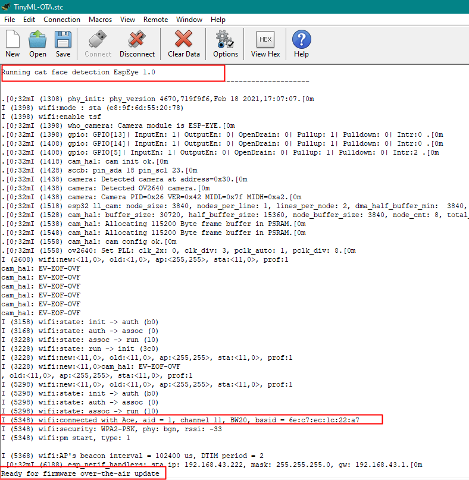
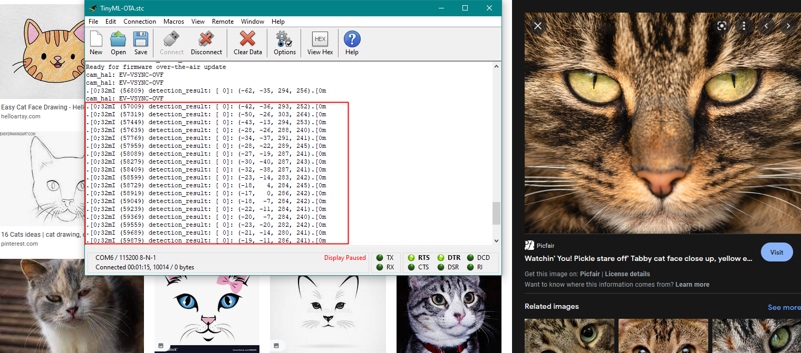
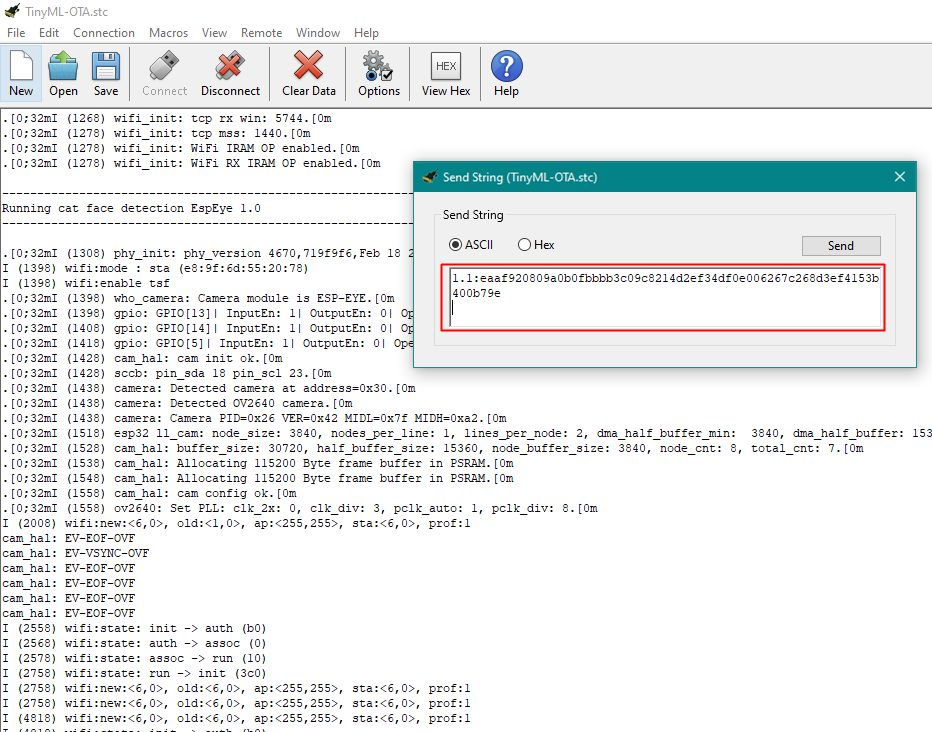
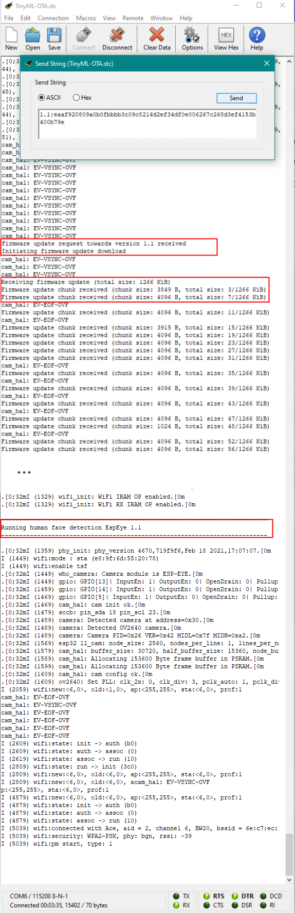
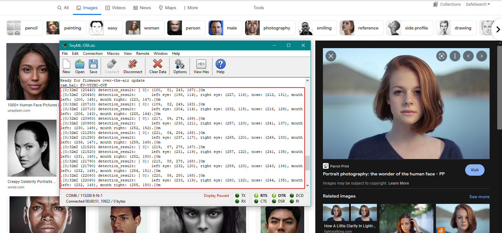

# TinyML FOTA update example

Tiny Machine Learning (TinyML) is a field of Machine Learning that focuses on the development and deployment of Machine Learning models on low power devices (embedded Linux or microcontroller-based). It's a combination between embedded systems and machine learning algorithms. FotaHub enables TinyML models running on such devices to be updated Over-The-Air (OTA). It thus solves the challenging problem of continuously deploying and improving the capabilies of AI-powered devices during their whole lifetime and regardless of their physical location. This example demonstrates how easy it is to put OTA updates of TinyML models through FotaHub into practice using Espressif's [ESP-EYE](https://www.espressif.com/en/products/devkits/esp-eye/overview) board. 

## Overview

Deep neural networks have gained fame for their capability to process visual information. In the past few years, they have become a key component of many computer vision applications. With that being said, the TinyML models used in this example fall under the computer vision shadow as well. The goal is to make an initial deployment of a cat detection model on an ESP32-based device with a built-in camera, and then over-the-air update it to a human face detection model.

## Operating principle
The device listens for a TinyML model update info string to be sent over the serial port. It is expected to consist of the new model version the device should be updated to, followed by a ':' separator and the checksum or signature of the new model version: 

`<new-version>:<verification-data>`

For example:<br>

`1.1:a15d5599d8745ff4f51690eb3996afcf75d0b1729d1b8cda2491b03940417521`

Once a valid update info string has been received and the contained new model version is different from the version of the model already running on the device, the TinyML model update procedure is triggered. It involves the device to connect to FotaHub and download the binary of the new model version. Thereby, it uses a dedicated URL including the id of the product representing the device in FotaHub, and the name and the version of the TinyML model binary to be retrieved, e.g.:

`https://bin.fotahub.com/7f52cf5e-7f0d-49dc-87fd-679ebfb94d8d/DemoProduct-1.1 `

The downloaded TinyML model binary is stored in the device's flash memory. At the same time, the downloaded model binary's checksum or signature is recalculated and compared to the checksum or signature included in the previously communicated update info string. If both match, the model update is applied by restarting the device and letting it boot into the flash memory partition where the downloaded TinyML model binary has been stored. After the restart, the device executes the new model version downloaded from FotaHub.

## Supported targets

The TinyML example can be used as is with the [ESP-EYE](https://www.espressif.com/en/products/devkits/esp-eye/overview) board. With some adaptations, it can also be used with other ESP32 development boards or hardware products provided they feature some sort of camera.

## Installation

A description of the SDKs and tools that must be available on your laptop or computer and advise how to install them can be found [here](../../README.md#installation).

# Usage

## Create a FotaHub product

Create a FotaHub product that represents your board in FotaHub as explained [here](../fotahub/create-product.md). It will be used to upload and provide  TinyML model updates for the same. 

### Get the FotaHub Device SDK for ESP32

If not yet done so, either clone or download and uncompress the [FotaHub Device SDK for ESP32](https://github.com/fotahub/fotahub-device-sdk-esp32) to a location of your choice on your machine. 

> &#x26A0; Make sure that the path to the location of the FotaHub Device SDK for ESP32 on your machine does not contain any spaces.

### Create and run initial TinyML model version

1. Start the Visual Studio Code and open (`File` > `Folder...`) the `cat-detection` example included in the FotaHub Device SDK for ESP32 (`<device-sdk-root>/examples/esp-eye/cat-detection`).
		
2. Go to the `Configuration.h` file in the `main` folder, and initialize the `WIFI_STATION_SSID` and `WIFI_STATION_PASSPHRASE` constants with the credentials of the Wi-Fi network you want to connect to with your board:

    ```C
    #define WIFI_STATION_SSID "my-fancy-WiFi-SSID"

    #define WIFI_STATION_PASSPHRASE "my-cryptic-WiFi-passphrase"
    ```

3. Open the `DemoProductInfo.h` file in the `main` folder, and initialize the `DEMO_PRODUCT_ID` and `DEMO_PRODUCT_NAME` constants with the id and the name of the previously created FotaHub product (see `Products` > `{{Your FotaHub product}}` > `Settings` > `General` at [Fotahub](https://fotahub.com)):

    
    
    Leave the `DEMO_PRODUCT_FIRMWARE_VERSION` as is for now. In case you have selected anything else than `SHA256` as the binary checksum algorithm for your FotaHub product or opted for using a signature instead, you also must adjust the `DEMO_PRODUCT_FIRMWARE_UPDATE_VERIFICATION_ALGORITHM` constant accordingly:

    ```C
    #define DEMO_PRODUCT_ID "183d06a3-881a-462f-9daa-bfe51608f8ff"
    #define DEMO_PRODUCT_NAME "EspEye"
    #define DEMO_PRODUCT_FIRMWARE_VERSION "1.0"
    #define DEMO_PRODUCT_FIRMWARE_UPDATE_VERIFICATION_ALGORITHM FOTA_UPDATE_VERIFICATION_ALGORITHM_SHA256
    ```

4. Open the integrated terminal (`Terminal` > `New Terminal`) and build the cat detection example with the help of the `idf.bat` or `idf.sh` script.
    
    When you have opted to use the ESP-IDF and ESP-WHO SDKs and the ESP32 toolchains through Docker, the `idf.bat`/`idf.sh` script must be run inside a Docker container providing the same. You can achieve that conveniently by making sure that Docker is running on your machine and invoking the `bind.bat`/`bind.sh` (**B**uild **IN** **D**ocker) script according to your operating system:
   
    **Windows:**   
    ```bat
    bind
    ```
    **Linux/Mac OS X:**   
    ```sh
    chmod +x bind.sh && chmod +x idf.sh
    ./bind.sh
    ```

    If you have installed the ESP-IDF and ESP-WHO SDKs as well as the ESP32 toolchains directly on your machine, you can invoke the `idf.bat`/`idf.sh` script right away. Specify the ESP-IDF and ESP-WHO install or checkout locations as the first two and the `build` command as third argument:

    **Windows:**   
    ```bat
    idf <ESP-IDF install/checkout location> <ESP-WHO install/checkout location> build
    ```
    **Linux/Mac OS X:**   
    ```sh
    chmod +x idf.sh
    ./idf.sh <ESP-IDF install/checkout location> <ESP-WHO install/checkout location> build
    ```

    > &#x1F6C8; When you need to run this command frequently, you may want to make known the ESP-IDF and ESP-WHO install or checkout locations once for all by setting environment variables named `IDF_PATH` and `WHO_PATH`at user or system level. You then only need to specify the `build` command as argument when invoking the `idf.bat`/`idf.sh` script.

5. Connect your board  to your laptop or computer using a USB cable, and identify the corresponding serial port (a guide explaining how to do so can be found [here](https://docs.espressif.com/projects/esp-idf/en/latest/esp32/get-started/establish-serial-connection.html) ) .

    > &#x26A0; It may happen that you are unable to find the serial port your board is connected to. Most of the time this is because the device driver for the USB to serial converter chip of your board is missing. You can fix that by manually installing the same as explained [here](../../README.md#general-purpose-tools).

6. Flash TinyML model binary that has resulted from building the cat detection example to your board.

    If you have used Docker and `bind` to build the TinyML model binary, you will notice that two new scripts, namely `flash.bat`/`flash.sh` and `erase.bat`/`erase.sh` have been created along the way. Use the first one to flash the TinyML model binary to your board and provide the serial port it is connected to as argument:

    **Windows:**   
    ```bat
    flash <COM port name, e.g., COM3>
    ```
    **Linux/Mac OS X:**   
    ```sh
    ./flash.sh <serial port name, e.g., /dev/ttyUSB0>
    ```

    If you have built the TinyML model binary with the help of the `idf.bat`/`idf.sh` script and the ESP-IDF and ESP-WHO SDKs as well as the ESP32 toolchains installed on your machine, use the same `idf.bat`/`idf.sh` script also to flash the TinyML model binary to your board. Specify the `flash` command as first and the serial port your board is connected to as second argument:

    **Windows:**   
    ```bat
    idf flash <COM port name, e.g., COM3>
    ```
    **Linux/Mac OS X:**   
    ```sh
    ./idf.sh flash <serial port name, e.g., /dev/ttyUSB0>
    ```

7. Start your serial monitor app, point it at the serial port your board is connected to, and set the baudrate to `115200` (`Connection` > `Options...` in CoolTerm). Open the configured serial port (`Connection` > `Connect` in CoolTerm), observe how the cat detection example starts up and verify whether it connects to the Wi-Fi network:

    

    That's it! You are ready to go for a quick test now. Open your browser and google some cat faces. Point the camera of your board to one of them and observe them being detected in the serial monitor output in the form of coordinates:

    


### Create and upload a new TinyML model version to FotaHub

1. As previously mentioned, the goal of this example is to evolve the cat detection feature on your board towards a human face detection capability by simply running a  TinyML model over-the-air update. To make this happen, go back to Visual Studio Code and open ( `File > Folder...`) the `human-face-detection` example included in the FotaHub Device SDK for ESP32 (`<device-sdk-root>/examples/esp-eye/human_face_detection`).
   
2. Go to the `Configuration.h` file in the `main` folder, and initialize the `WIFI_STATION_SSID` and `WIFI_STATION_PASSPHRASE` constants with the credentials of your Wi-Fi network as you did in the cat detection example already (see step 2 in the previous section).

    ```C
    #define WIFI_STATION_SSID "my-fancy-WiFi-SSID"

    #define WIFI_STATION_PASSPHRASE "my-cryptic-WiFi-passphrase"
    ```

3. Open the `DemoPrudctInfo.h` in the `main` folder, and initialize the `DEMO_PRODUCT_ID`, `DEMO_PRODUCT_NAME`, and `DEMO_PRODUCT_FIRMWARE_UPDATE_VERIFICATION_ALGORITHM ` constants with the same values you have used in the cat detection example (see step 3 in the previous section). Bump the `DEMO-PRODUCT-FIRMWARE-VERSION` constant this time to indicate the version of the new TinyML model:
  
    ```C
    #define DEMO_PRODUCT_ID "183d06a3-881a-462f-9daa-bfe51608f8ff"

    #define DEMO_PRODUCT_NAME "EspEye"

    #define DEMO_PRODUCT_FIRMWARE_VERSION "1.1"

    #define DEMO_PRODUCT_FIRMWARE_UPDATE_VERIFICATION_ALGORITHM FOTA_UPDATE_VERIFICATION_ALGORITHM_SHA256
    ```

4. Rebuild the human face detection example using Docker and `bind` or the `idf.bat`/`idf.sh` script in very much the same way as you did for building the cat detection example (see step 4 in the previous section). Locate the resulting new TinyML model binary file named `humanfacedetection.bin` in the `build` folder (using the `Explorer` view).
   
    > &#x1F6C8; You can locate the new TinyML model binary file also in your file system explorer or copy its path to the clipboard by using corresponding context menu actions in Visual Studio Code (`Reveal in File Explorer` and `Copy Path`). This can come quite handy in the subsequent steps.
		
5. Upload the new binary (`build/humanfacedetection.bin`) as TinyML model version `1.1` to your FotaHub product as explained [here](../fotahub/upload-firmware.md).
   
###  Make your first TinyML model over-the-air update

1. Go back to the serial monitor app showing the execution status of your board running the initial TinyML model version. Enter the new model version followed by a ':' separator, the checksum or signature of the same (see `Products` > `{{Your FotaHub product}}` > `Details` > `{{New TinyML model version}}` at [Fotahub](https://fotahub.com)), and a terminating line break in the text field or dialog provided for sending data over the opened serial port (`Connection` > `Send String...` in CoolTerm):

    

    > &#x1F6C8; In most cases, your serial monitor app can be configured to automatically terminate all strings being sent with a line break so that you can't forget to do so manually upon every submission (`Connection` > `Options...` > `Transmit` > `Send String Options` > `Terminate 'Send String' Data` in CoolTerm).

2. Submit the TinyML model update info string to your board (`Send` button in CoolTerm). This will trigger the TinyML model over-the-air update procedure. Upon successful completion, the board will be restarted with the new model version downloaded from FotaHub. To verify that, check the model version in the banner showing up in the serial monitor output:

    

    Great! You can start using the updated TinyML model right away. Point the camera on your board to different human faces (or photos of any such), and observe how the coordinates of those faces appear in the serial monitor output:

    

